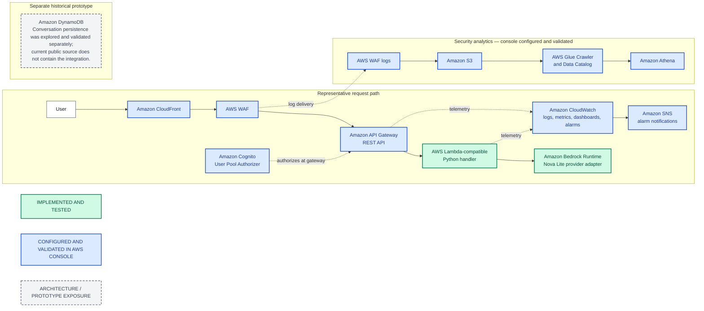

# AWS AI Knowledge Assistant Portfolio

A Python serverless Generative AI backend demonstrating a versioned REST contract, AWS Lambda-compatible request handling, Amazon Bedrock Nova Lite integration, defensive validation, and automated testing, supported by documented AWS architecture and console configuration experience.

## Business problem

An AI assistant needs more than a model call. It needs a stable API contract, controlled inputs, predictable failure behavior, operational boundaries, and an architecture that can be secured and observed. This repository presents a small, sanitized implementation of those backend concerns while clearly separating code evidence from prior AWS console experience and design work.

This is a curated portfolio representation, not a complete production system or reproducible deployment.

## Evidence legend

| Classification | Meaning |
|---|---|
| **IMPLEMENTED AND TESTED** | Code and automated tests exist in this public portfolio repository. |
| **CONFIGURED AND VALIDATED IN AWS CONSOLE** | The service was personally configured and exercised in AWS, but reproducible IaC was not retained. |
| **ARCHITECTURE / PROTOTYPE EXPOSURE** | Architecture/design work or a separate historical prototype exists, but the capability is not implemented in the current public source. |
| **KNOWN LIMITATION** | The capability is not implemented or is not sufficiently evidenced here. |

## Implementation status

| Capability | Classification | Public evidence |
|---|---|---|
| Python backend | **IMPLEMENTED AND TESTED** | [`src/knowledge_assistant/`](src/knowledge_assistant/) |
| Lambda-compatible handler | **IMPLEMENTED AND TESTED** | [`lambda_handler.py`](src/knowledge_assistant/lambda_handler.py) |
| Versioned REST contract | **IMPLEMENTED AND TESTED** | [`contracts.py`](src/knowledge_assistant/contracts.py), [`app.py`](src/knowledge_assistant/app.py) |
| Defensive JSON validation | **IMPLEMENTED AND TESTED** | [`validation.py`](src/knowledge_assistant/validation.py) |
| Deterministic serialization | **IMPLEMENTED AND TESTED** | [`contracts.py`](src/knowledge_assistant/contracts.py) |
| Provider abstraction | **IMPLEMENTED AND TESTED** | [`providers.py`](src/knowledge_assistant/providers.py) |
| Bedrock Runtime / Nova Lite | **IMPLEMENTED AND TESTED** | [`bedrock.py`](src/knowledge_assistant/bedrock.py), [`test_bedrock.py`](tests/test_bedrock.py) |
| API Gateway, Cognito, CloudWatch, SNS, S3, Glue, Athena, CloudFront, WAF | **CONFIGURED AND VALIDATED IN AWS CONSOLE** | [AWS console experience](docs/aws-console-experience.md) |
| DynamoDB conversation history | **ARCHITECTURE / PROTOTYPE EXPOSURE** | [Implementation status](docs/implementation-status.md#architecture--prototype-exposure) |
| Authentication | **CONFIGURED AND VALIDATED IN AWS CONSOLE** | Cognito authorizer boundary; no application JWT verification claim |
| Authorization | **ARCHITECTURE / PROTOTYPE EXPOSURE** | [Private authorization boundary](docs/security.md#private-authorization-boundary) |
| CORS | **KNOWN LIMITATION** | Not implemented |
| Targeted unit testing | **IMPLEMENTED AND TESTED** | [`tests/`](tests/) — 22 tests |
| Production readiness | **KNOWN LIMITATION** | Selected production-readiness foundations are demonstrated; this is not a production deployment |

The complete capability-by-capability matrix is in [Implementation Status](docs/implementation-status.md).

## Architecture

The colors distinguish repository evidence from console experience and historical prototype work.



The editable diagram source is [`docs/architecture/architecture.mmd`](docs/architecture/architecture.mmd). GitHub-native Mermaid rendering is used; a local SVG build is not currently configured.

## Request flow

1. A Lambda proxy event targets `POST /v1/assistant`.
2. The application adapter recognizes the REST or HTTP API event shape.
3. The request body is parsed with duplicate-key detection.
4. The versioned contract, required fields, identifiers, roles, message count, and content bounds are validated.
5. A normalized request crosses the provider protocol boundary.
6. The Bedrock adapter maps messages to the `converse` API shape for Nova Lite.
7. Success or safe provider failure is returned in a deterministic JSON envelope.

## Implemented code walkthrough

- [`contracts.py`](src/knowledge_assistant/contracts.py) defines immutable request/response models and stable JSON serialization.
- [`validation.py`](src/knowledge_assistant/validation.py) rejects malformed JSON, duplicate and unknown fields, unsupported versions, invalid identifiers, invalid roles, and oversized requests.
- [`providers.py`](src/knowledge_assistant/providers.py) keeps application behavior independent of a concrete model provider.
- [`bedrock.py`](src/knowledge_assistant/bedrock.py) demonstrates Bedrock Runtime client construction, Nova Lite configuration, `converse` mapping, response extraction, and sanitized provider errors.
- [`app.py`](src/knowledge_assistant/app.py) provides bounded REST-oriented routing and HTTP responses.
- [`lambda_handler.py`](src/knowledge_assistant/lambda_handler.py) exposes the Lambda-compatible entry point and supports dependency injection for tests.

## AWS console experience

The broader architecture was configured and validated directly in AWS. That experience includes API Gateway REST integration, a Cognito User Pool authorizer, CloudWatch observability and alarms, SNS notifications, CloudFront and TLS delivery, WAF protections, and an S3/Glue/Athena security-analytics workflow.

IaC was not retained. Live identifiers are intentionally omitted, and this repository must not be interpreted as reproducible deployment configuration. See [AWS Console Experience](docs/aws-console-experience.md).

## Security approach

The public code demonstrates strict request parsing, bounded inputs, an explicit provider boundary, safe error envelopes, no embedded credentials, and route/method allowlisting. Gateway authentication, edge protections, and operational controls are documented separately from implemented code.

See [Security](docs/security.md) for trust boundaries, non-claims, known gaps, and the public-release checklist.

## Testing

The portfolio currently contains **22 passing unit tests**. They exercise validation, deterministic responses, routing, Bedrock request/response mapping, and provider failures. Tests use fakes or injected stubs and do not call AWS.

Run locally:

```bash
PYTHONDONTWRITEBYTECODE=1 PYTHONPATH=src python3 -m unittest discover -s tests -p 'test_*.py' -v
```

## Known limitations

Key non-claims include no IaC, CORS, application JWT verification, Cognito-claim consumption, current DynamoDB persistence, RAG/vector database, live AWS integration tests, deployment automation, load testing, formal SLOs, or disaster-recovery implementation.

This repository demonstrates selected production-readiness foundations; it is not a production deployment and is not described as production-ready or production-grade. See [Limitations](docs/limitations.md).

## Repository map

```text
src/knowledge_assistant/   Sanitized representative Python implementation
tests/                     Focused unit tests with no AWS calls
docs/implementation-status.md
                           Detailed evidence classification matrix
docs/aws-console-experience.md
                           Console-configured AWS experience and boundaries
docs/security.md           Security scope, controls, gaps, and release checks
docs/cost-considerations.md
                           Generic cost drivers and controls
docs/decisions.md          Sanitized architecture decisions
docs/limitations.md        Explicit non-claims and deferred capabilities
docs/architecture/         GitHub-rendered Mermaid architecture source
```

## Privacy and IP note

This repository is a deliberately curated public portfolio. Live infrastructure identifiers, private engineering history, business-specific implementation details, and proprietary material are intentionally excluded.

